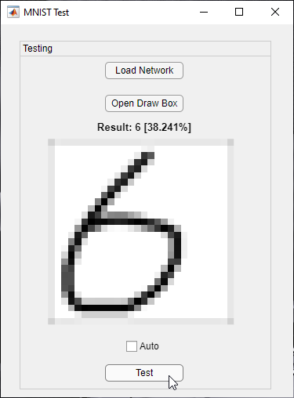

# MNIST-Trainer-and-Tester-in-MATLAB
Downloader, trainer and tester (draw in gui) in MATLAB

This project aims create network, training and testing network with MNIST dataset in MATLAB. 

Main file is `Main.m`. If you run this file you will get a question about downloading MNIST dataset and after download dataset code will start put labels to output matrix. Code will run training given input, output and predefined various layer sizes takes a time depending on your computer.

The `app1.mlapp` gui file using for testing. In gui screen you will open draw window for draw number and test with network you created before.

